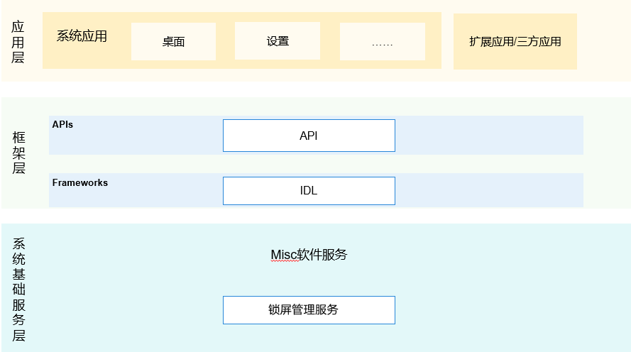

# 锁屏管理服务

## 简介
### 内容介绍
锁屏管理服务是OpenHarmony中系统服务，为锁屏应用提供注册亮屏、灭屏、开启屏幕、结束休眠、退出动画、请求解锁结果监听，并提供回调结果给锁屏应用。锁屏管理服务向三方应用提供请求解锁、查询锁屏状态、查询是否设置锁屏密码的能力。

**图 1** 架构图



### 框架图介绍 
1.三方应用支持操作请求解锁、查询锁屏状态、查询是否设置锁屏密码接口调用。\
2.锁屏应用注册亮屏、灭屏、开启屏幕、结束休眠、退出动画、请求解锁结果监听等事件 \
3.框架层API用来处理三方应用和锁屏应用的js接口请求处理，NAPI层进行js调用的处理 \
4.框架层IDL用来处理NAPI接口向锁屏管理服务之间的桥梁，进行IPC通讯 \
5.锁屏管理服务用来处理三方应用和锁屏应用接口请求，并作出对应处理，提供相应的返回结果。

## 目录

```
/base/theme/screenlock_mgr
├── figures                  # 架构图
├── frameworks
│   ├── js/napi              # js接口解析成napi接口
│   └── native               # 对客户端提供的接口
├── sa_profile               # 组件包含的系统服务的配置文件和进程的配置文件
├── services                 # 锁屏管理服务实现
├── test                     # 接口的单元测试
└── utils                    # 组件包含日志打印和有序公共事件定义的常量
```

## 说明

### 接口说明

-   ScreenLock接口文档 [js-apis-screen-lock.md](https://gitee.com/openharmony/docs/blob/master/zh-cn/application-dev/reference/apis/js-apis-screen-lock.md) 提供从API version 7开始的接口定义和示例代码。

## 相关仓

**主题框架子系统**

[theme\_screenlock_mgr](https://gitee.com/openharmony/theme_screenlock_mgr)

